# MindShift


<p align="center">
  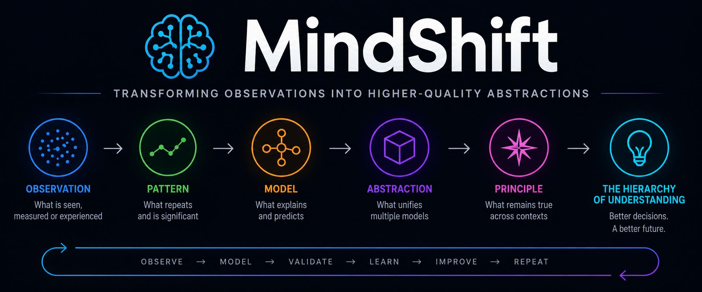
</p>

## Research Framework for Transferable Abstraction

> MindShift transforms observations into higher-quality abstractions that improve understanding.

MindShift is a non-operational research framework for studying how observations become transferable abstractions, mental models, and reusable knowledge.

MindShift improves understanding. It does not execute, authorize, govern, or mutate external systems.

---

## The Journey from Information to Impact

<p align="center">
  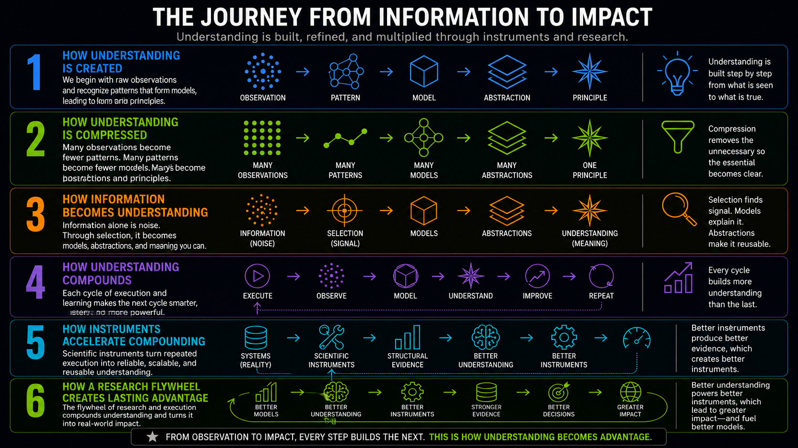
</p>

---

MindShift studies how observations become reusable understanding.

## Canonical Purpose

```text
Reality
        ↓
Observation
        ↓
Higher-Quality Abstractions
        ↓
Better Understanding
```

---

### Hierarchy of Understanding

The hierarchy below situates that purpose within the progression from reality to understanding.

<p align="center">
  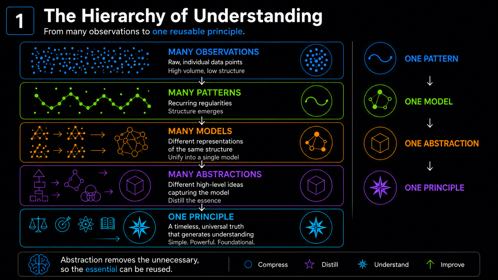
</p>

---

## Canonical Research Question

```text
How can observations be converted into transferable abstractions that improve future modeling?
```

---

### From Information to Understanding

The following figure traces the movement from information to understanding.

<p align="center">
  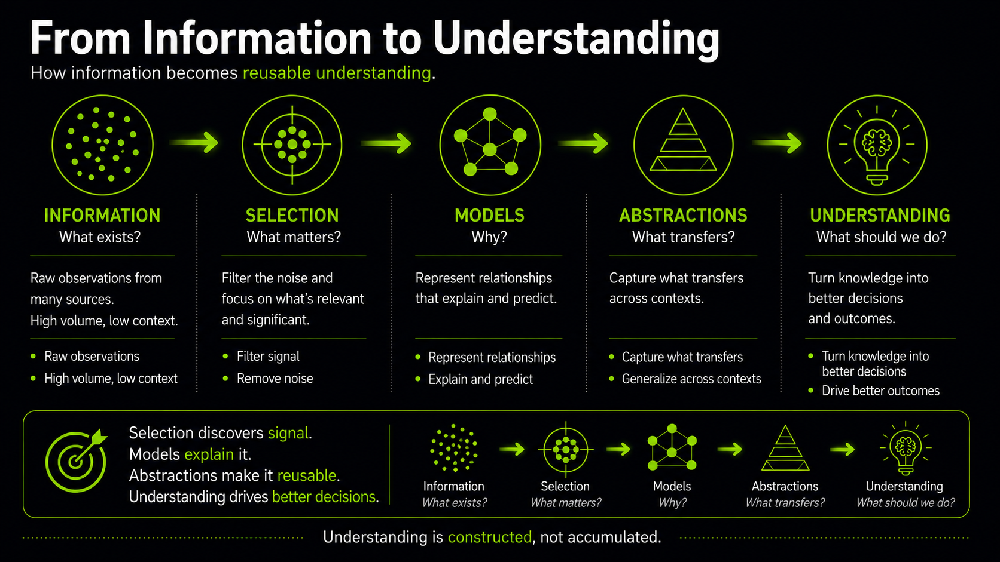
</p>

---

## Canonical Research Sequence

```text
Observation
→ Pattern
→ Abstraction
→ Primitive
→ Transfer
```

This is a research sequence, not a runtime, execution loop, or computational
lifecycle.

---

### Understanding Compounds

Understanding compounds as these research steps are revisited over time.

<p align="center">
  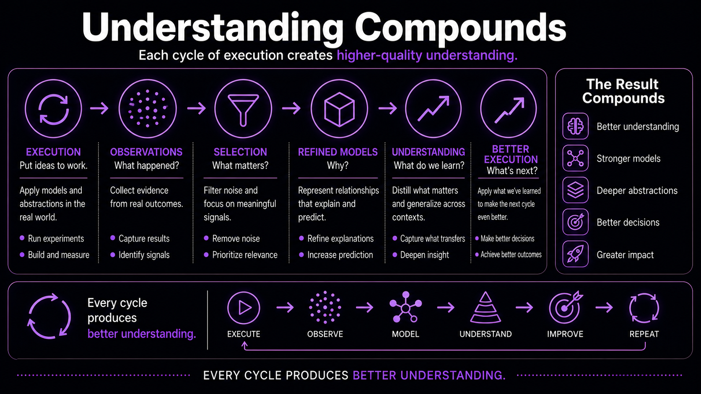
</p>

---

## What MindShift Studies

MindShift studies:

- observations;
- pattern identification;
- abstraction formation;
- primitive extraction;
- transfer across contexts;
- learning reflection; and
- model improvement.

MindShift does not define a machine object for primitives. It studies how
transferable abstractions emerge and how they improve future modeling.

---

### Scientific Instruments Accelerate Learning

Scientific instruments and the research flywheel illustrate how the framework accelerates learning.

<p align="center">
  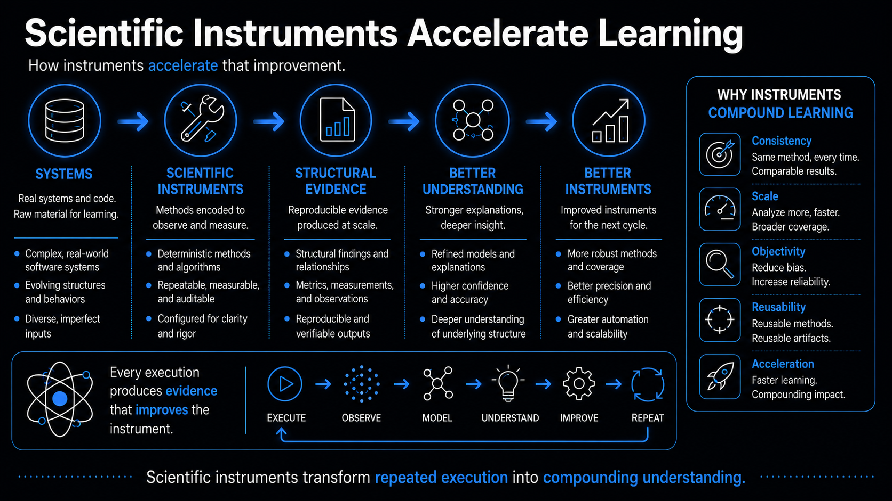
</p>

### Research Flywheel

<p align="center">
  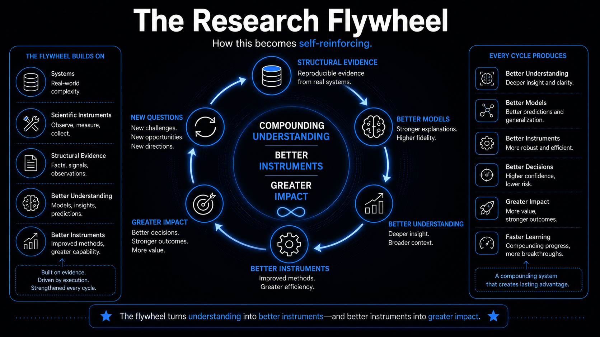
</p>

---

## Boundaries

MindShift is not:

- independent infrastructure;
- a deterministic runtime;
- execution infrastructure;
- legitimacy infrastructure;
- authority infrastructure;
- governance infrastructure; or
- an agent framework.

MindShift does not own execution, authority, approval, legitimacy, execution
eligibility, execution boundaries, proof closure, governed mutation, or replay.
MindShift also excludes deterministic structural analysis from its scope.

> **Evidence boundary:** This repository is locally authoritative only for
> MindShift's scope. It does not cite an immutable authoritative specification
> for SYNAPSE or ContinuityOS, so their responsibility assignments remain
> externally unresolved and are not asserted here.

Repository governance, whether or not it uses an external mechanism such as
ContinuityOS, is not MindShift functionality.

---

## Long-Term Vision

These research principles motivate a broader vision for engineering.

### Engineering Becomes the Production of Understanding

<p align="center">
  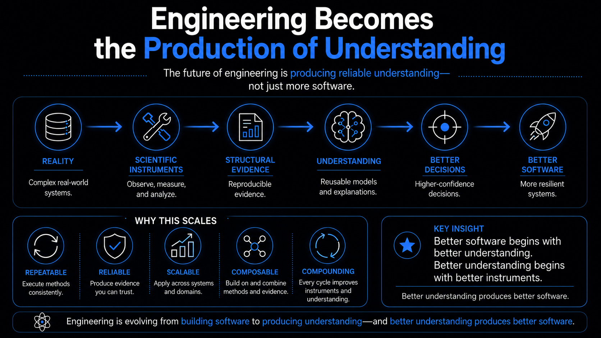
</p>

### Future Vision

<p align="center">
  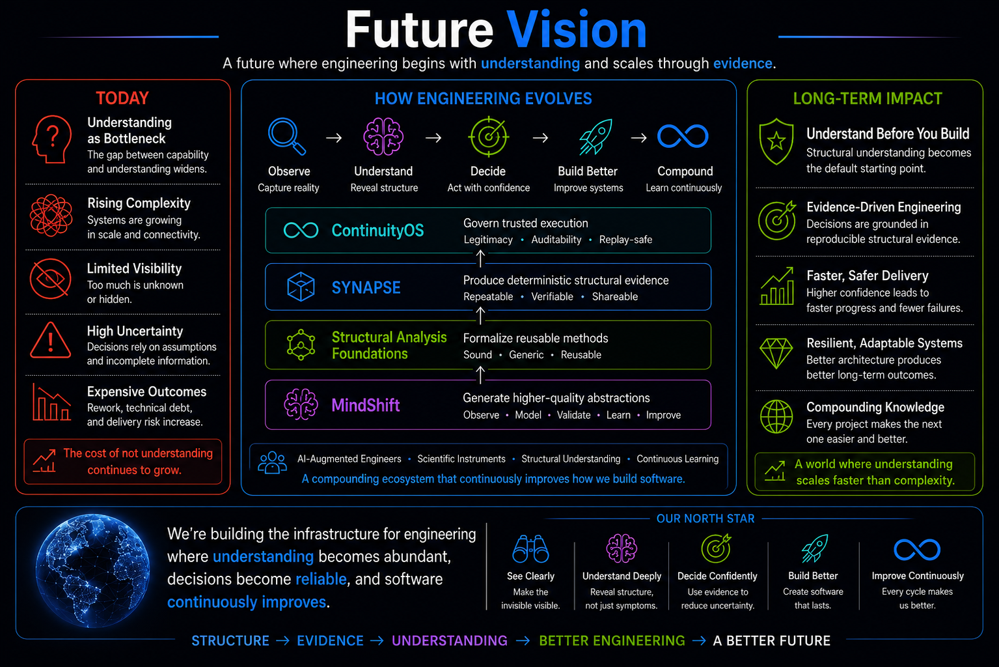
</p>

## Evidence in Practice

The value of a research framework is measured by the evidence and engineering decisions it enables.

<p align="center">
  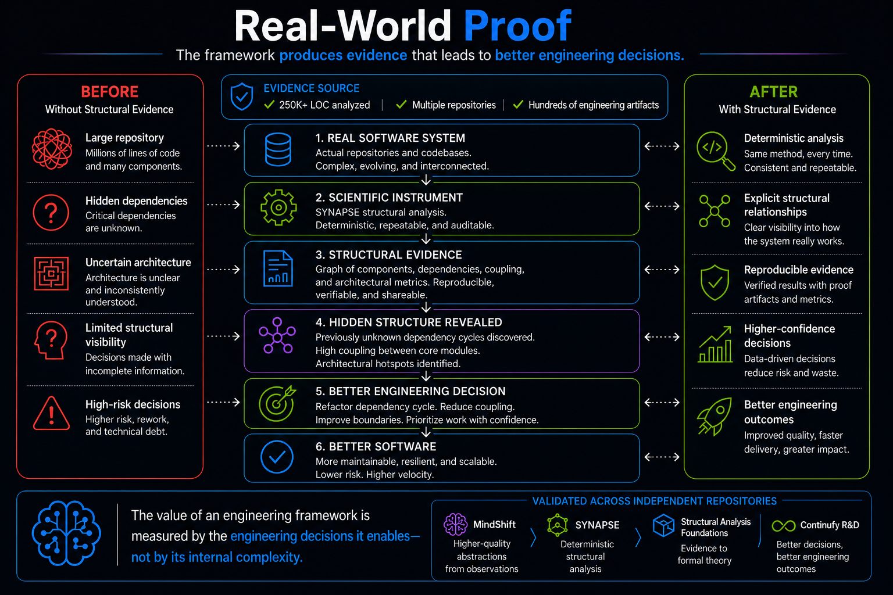
</p>

## Why Understanding Matters

<p align="center">
  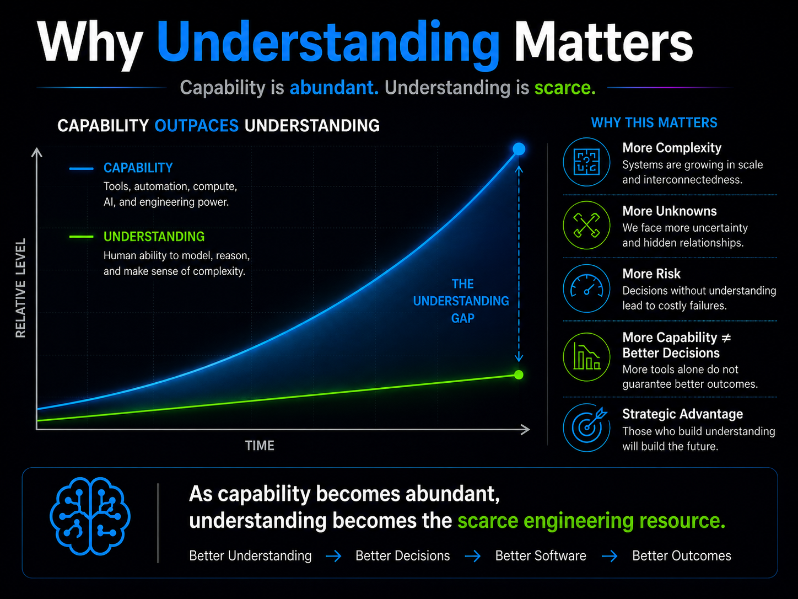
</p>

---

## Repository Structure

| Path | Purpose |
| --- | --- |
| [`README.md`](README.md) | Canonical project overview |
| [`CLAUDE.md`](CLAUDE.md) | Contributor operating guide |
| [`docs/thesis.md`](docs/thesis.md) | Canonical thesis and decision filter |
| [`docs/research-sequence.md`](docs/research-sequence.md) | The canonical Observation → Pattern → Abstraction → Primitive → Transfer sequence |
| [`docs/principles.md`](docs/principles.md) | Research principles |
| [`docs/frameworks.md`](docs/frameworks.md) | Optional lenses used to study learning and abstraction transfer |
| [`docs/context-window-abstraction-hypothesis.md`](docs/context-window-abstraction-hypothesis.md) | Exploratory candidate hypothesis on context availability and reusable abstractions |
| [`docs/grandmaster-mode.md`](docs/grandmaster-mode.md) | Analysis method for extracting transferable lessons |
| [`docs/examples/`](docs/examples/) | Worked analyses that feed lessons back into the method |
| [`docs/lineage.md`](docs/lineage.md) | Historical context for the surviving research invariant |
| [`docs/scope.md`](docs/scope.md) | Project boundaries |
| [`docs/roadmap.md`](docs/roadmap.md) | Future optional work filtered against the thesis |
| [`docs/reference-execution/v1.0/freeze-readiness-record.md`](docs/reference-execution/v1.0/freeze-readiness-record.md) | Repository-owned Reference Execution v1.0 freeze and readiness determination |
| [`CONTRIBUTING.md`](CONTRIBUTING.md) | Contribution guidance |
| [`LICENSE`](LICENSE) | Apache-2.0 License |
