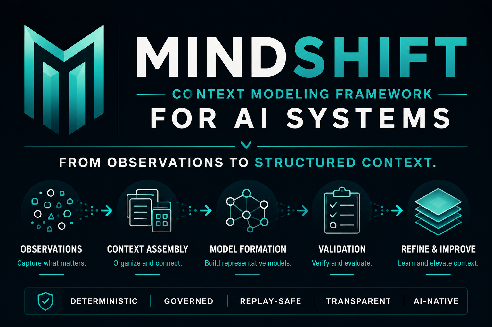

# MindShift

<p align="center">
  
</p>

## Research Framework for Transferable Abstraction

> From observations to transferable abstractions.

MindShift is a research framework for studying how observations become
transferable abstractions that improve future modeling.

---

## Canonical Research Question

```text
How can observations be converted into transferable abstractions that improve future modeling?
```

---

## Canonical Research Sequence

```text
Observation
→ Pattern
→ Abstraction
→ Primitive
→ Transfer
```

This is a research sequence, not a runtime, execution loop, or computational
lifecycle.

---

## What MindShift Studies

MindShift studies:

- observations;
- pattern identification;
- abstraction formation;
- primitive extraction;
- transfer across contexts;
- learning reflection; and
- model improvement.

MindShift does not define a machine object for primitives. It studies how
transferable abstractions emerge and how they improve future modeling.

---

## Boundaries

MindShift is not:

- independent infrastructure;
- a deterministic runtime;
- execution infrastructure;
- legitimacy infrastructure;
- authority infrastructure;
- governance infrastructure; or
- an agent framework.

MindShift does not own execution, authority, approval, legitimacy, execution
eligibility, execution boundaries, proof closure, governed mutation, or replay.
Those responsibilities belong outside the MindShift research framework.

SYNAPSE owns deterministic structural analysis.

ContinuityOS may govern this repository, but repository governance is not
MindShift functionality.

---

## Repository Map

| Path | Purpose |
| --- | --- |
| [`README.md`](README.md) | Canonical project overview |
| [`CLAUDE.md`](CLAUDE.md) | Contributor operating guide |
| [`docs/thesis.md`](docs/thesis.md) | Canonical thesis and decision filter |
| [`docs/research-sequence.md`](docs/research-sequence.md) | The canonical Observation → Pattern → Abstraction → Primitive → Transfer sequence |
| [`docs/principles.md`](docs/principles.md) | Research principles |
| [`docs/frameworks.md`](docs/frameworks.md) | Optional lenses used to study learning and abstraction transfer |
| [`docs/grandmaster-mode.md`](docs/grandmaster-mode.md) | Analysis method for extracting transferable lessons |
| [`docs/examples/`](docs/examples/) | Worked analyses that feed lessons back into the method |
| [`docs/lineage.md`](docs/lineage.md) | Historical context for the surviving research invariant |
| [`docs/scope.md`](docs/scope.md) | Project boundaries |
| [`docs/roadmap.md`](docs/roadmap.md) | Future optional work filtered against the thesis |
| [`CONTRIBUTING.md`](CONTRIBUTING.md) | Contribution guidance |
| [`LICENSE`](LICENSE) | Apache-2.0 License |
