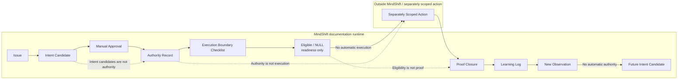

# Manual Runtime Lifecycle Runbook

## Purpose

This runbook is the contributor-facing guide for moving through the
MindShift runtime lifecycle manually while preserving the runtime's
non-operative boundary.

It makes the existing lifecycle understandable and usable without adding a new
stage, automation, external service, execution behavior, authority creation,
proof creation, eligibility mutation, deployment, merge behavior, or API calls.

## What this runbook is

This runbook is:

- a manual documentation guide;
- a contributor orientation map;
- a boundary checklist for understanding which artifact comes next;
- a reminder that each lifecycle artifact has a limited responsibility; and
- a visualization of how learning returns to observation.

## What this runbook is not

This runbook is not:

- an authority source;
- an execution mechanism;
- an eligibility engine;
- a proof generator;
- a deployment, merge, or release process;
- an API integration; or
- a dependency on any external governance or execution system.

Following this runbook does not automatically authorize, execute, validate,
prove, deploy, merge, call APIs, or determine future eligibility.

## Full lifecycle

```text
Issue
→ Intent Candidate
→ Manual Approval
→ Authority Record
→ Execution Boundary Checklist
→ Eligible / NULL
→ Separately Scoped Action
→ Proof Closure
→ Learning Log
→ New Observation
```

The loop may continue only by turning the new observation into a future intent
candidate. New observation does not automatically start execution.



## Step-by-step manual path

1. Open an intent candidate issue.
2. Capture the observation, model, evidence, proposed action, requested scope,
   expected proof, and learning question.
3. Wait for manual maintainer review.
4. Create or reference an authority record only after explicit approval.
5. Complete the execution-boundary checklist.
6. Record `Eligible / NULL` as readiness only.
7. Keep any separately scoped action outside this non-operative runtime.
8. Record proof closure only after the scoped action occurred.
9. Record the learning log.
10. Convert learning into a new observation, not automatic authority.

## Boundary table

| Stage | Artifact | Can do | Cannot do |
| --- | --- | --- | --- |
| Intent Candidate | GitHub issue or intent candidate form | Preserve an observation, model, evidence, proposed action, requested scope, expected proof, and learning question for review. | Intent candidates are not authority; they cannot approve, execute, create proof, mutate eligibility, deploy, merge, or call APIs. |
| Manual Approval | Maintainer review reference | Record that a maintainer explicitly approved creation or reference of a bounded authority record. | Cannot execute actions, create proof, mutate eligibility, deploy, merge, call APIs, or bypass the authority record. |
| Authority Record | `runtime/authority/` record or linked authority artifact | Document bounded approval, constraints, exclusions, expected proof, and NULL conditions. | Authority is not execution; it cannot execute actions, create proof, determine final proof, deploy, merge, call APIs, or mutate future eligibility. |
| Execution Boundary Checklist | `runtime/execution-boundary/` checklist | Review whether the scoped action is bounded, constrained, and ready to be marked `Eligible / NULL`. | Cannot execute actions, create authority, create proof, deploy, merge, call APIs, or turn readiness into evidence. |
| Eligible / NULL | Checklist result | Record readiness only: `Eligible` means the bounded action may be separately scoped; `NULL` means it is not ready. | Eligibility is not proof; it cannot prove anything happened, execute actions, create authority, deploy, merge, call APIs, or mutate later eligibility automatically. |
| Separately Scoped Action | External bounded action | Occur outside MindShift only if separately authorized, scoped, and performed by the responsible external process. | Cannot be performed by this runtime; cannot be created by the checklist; cannot make MindShift an execution platform. |
| Proof Closure | `runtime/proof/` closure | Record evidence after a separately scoped action occurred, including result and unresolved gaps. | Proof is not authority; it cannot authorize future work, execute actions, mutate eligibility, deploy, merge, call APIs, or replace manual approval. |
| Learning Log | `runtime/learning/` log | Interpret proof closure, identify validated or falsified assumptions, and name a new observation. | Learning does not mutate authority; Learning does not mutate execution eligibility; it cannot execute actions, create proof, deploy, merge, call APIs, or authorize future work. |
| New Observation | Future issue or observation record | Become the input for a future issue or intent candidate. | New observation does not automatically start execution; it cannot create authority, create proof, mutate eligibility, deploy, merge, or call APIs. |

## What stays outside MindShift

The separately scoped action stays outside MindShift. MindShift can document the
intent, authority record, readiness review, proof closure, and learning record,
but the action itself is not performed by the MindShift runtime.

External or optional systems, including ContinuityOS if used elsewhere, remain
outside MindShift. MindShift does not depend on them, does not call them, and
does not transfer automatic authority, execution, eligibility, or proof to them.

## How learning returns to observation

Learning closes the loop only by producing a new observation. The learning log
may record what changed, what was validated, what was falsified, and what should
be considered next.

That new observation can become a future issue or intent candidate, but it must
start the lifecycle again. It does not inherit authority, eligibility, proof, or
execution capability from the previous cycle.
